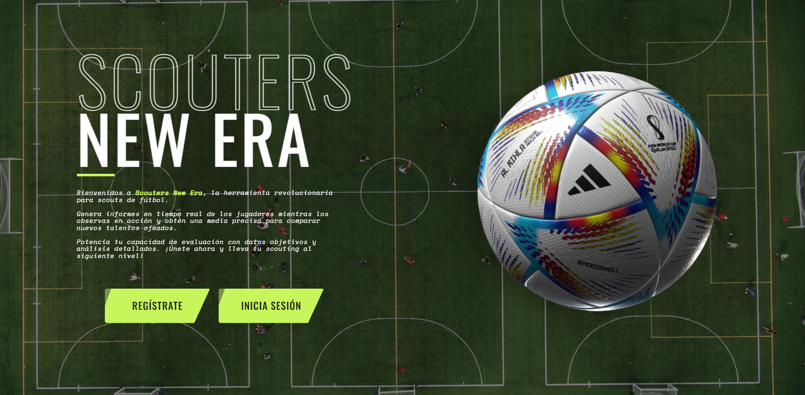
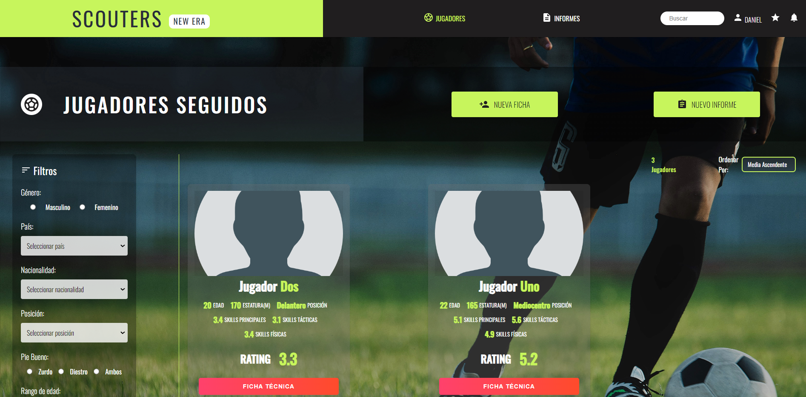
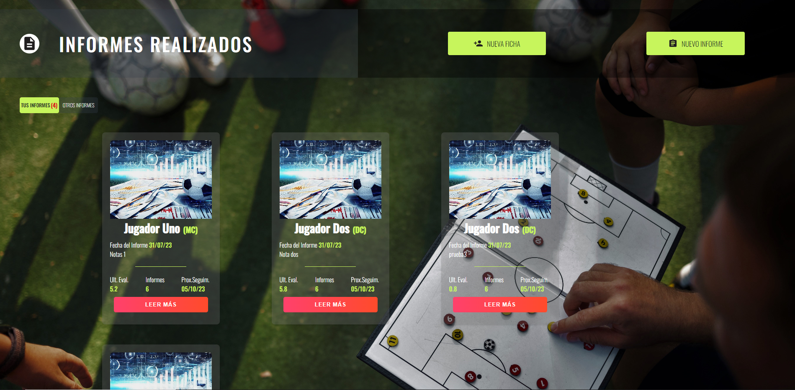
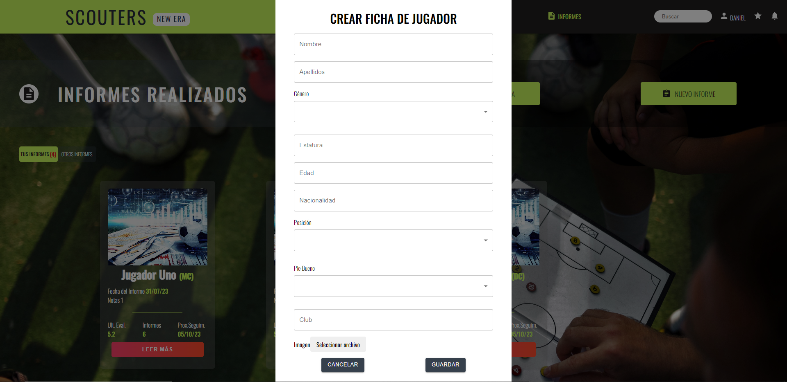
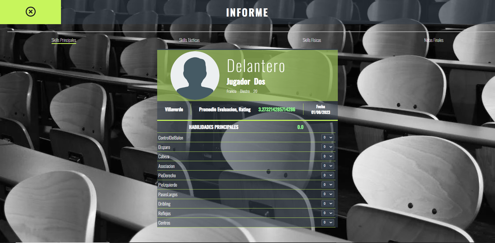
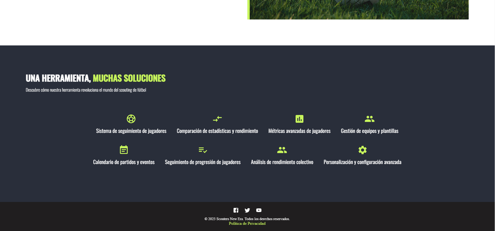

# Scouters New Era - Plataforma para Scouts de Fútbol
Bienvenid@ a Scouters! Una plataforma diseñada para scouts de fútbol que permite generar informes en tiempo real de los jugadores mientras son observados en acción. Los ojeadores pueden obtener una media precisa para comparar nuevos talentos identificados. La plataforma cuenta con autenticación de usuarios para el registro y el inicio de sesión.

## Objetivo
El objetivo principal de Scouters es facilitar el proceso de seguimiento y evaluación de jugadores de fútbol mediante la creación de informes detallados en tiempo real y una obtención de métricas y medias a base de estos informes.

## Características
 - Generación de informes en tiempo real.
 - Autenticación de usuarios para registro y login.

# Tecnologías Utilizadas
 ## Front-end
- HTML5
- CSS3
- JavaScript
- React (Implementado con el concepto Atomic Design)
- Material UI (Biblioteca de componentes de interfaz de usuario para React)

 

 

## Back-end & Data Base
- Node.js
- MongoDB (utilizando Mongoose y Express)

 

## Herramientas Utilizadas
- Figma: para diseño y prototipado.
- Thunder Client: para gestionar el diseño y test de APIS.
- Visual Studio Code
- Trello: para la gestión del proyecto.
- Git y GitHub: para el control de versiones y colaboración en el código.

 

## Fuentes y Iconos
- Google Fonts: se utiliza una fuente de Google Fonts para mejorar el aspecto tipográfico de la plataforma.
- Material Icons: se utilizan íconos de Material Icons para mejorar la experiencia de usuario.

# Instalación

1. Clonar el proyecto
2. git clone https://github.com/Danizetaeme/Proyecto_Scouters.git
3. Instalar las dependencias del front-end y back-end con el comando:

* npm install

### Para iniciar el cliente:
* npm start

### Para iniciar el servidor:
* nodemon app

# Equipo de Desarrollo
- Daniel Zafra: Developer & Product Owner
- Alejandro Mitjans: Developer & Scrum Master
- Edgar Ríos: Developer
- Pablo Ledezma: Developer
- Miguel Ángel Seiz: Developer

## Agradecimientos
Agradecemos a Scouz por su contribución en la definición de la interfaz de usuario (UI) del proyecto y por la confianza depositada en este equipo.

¡Gracias por usar Scouters! Si tienes alguna sugerencia o comentario, no dudes en contactarnos. ¡Disfruta de la plataforma! 👍

# FOTOS DEL PROYECTO

